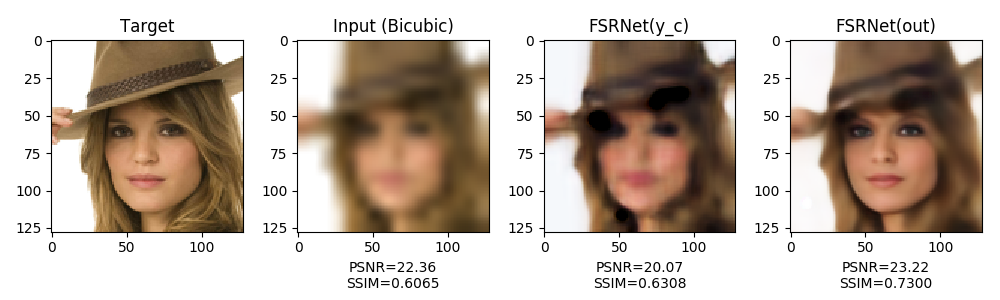
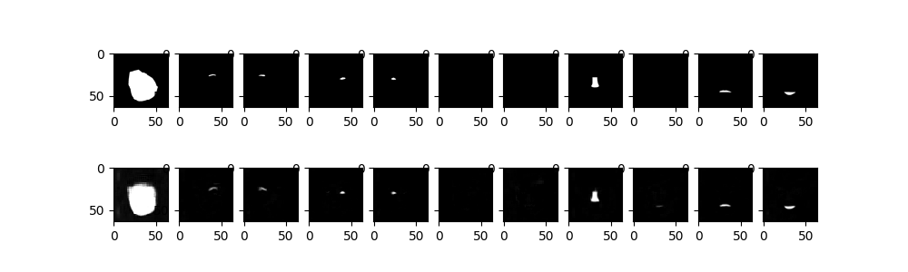
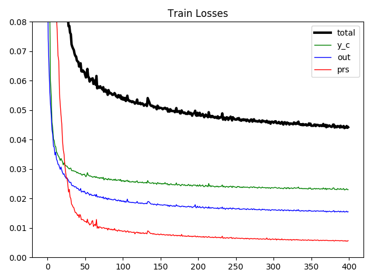
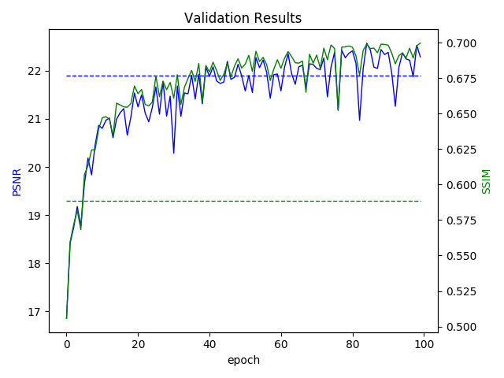
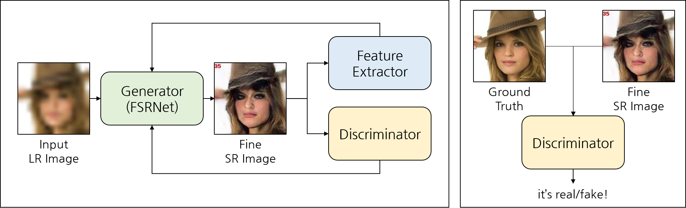

# FSRNet-pytorch

This repository is a PyTorch implementation of [FSRNet: End-to-End Learning Face Super-Resolution with Facial Priors](https://arxiv.org/abs/1711.10703). Official demo code and other re-implementations available at:

* [Official demo code](https://github.com/tyshiwo/FSRNet)
* [cydiachen's code (PyTorch)](https://github.com/cydiachen/FSRNET_pytorch)
* [liang23333's code (TensorFlow)](https://github.com/liang23333/FSRNet-Tensorflow)

_**Note: This repository has not yet reproduced the performance of the original implementation.**_

## Demo

```
python demo.py --checkpoint ./e099_psnr22.53.pth
```




## Datasets

### Helen Dataset [[Link](http://www.ifp.illinois.edu/~vuongle2/helen/)]

Helen Dataset provides **194 facial-landmark points** by default, and this allows you to construct the *landmark heatmap*. To obtain the *parsing-map* from Helen Dataset, you can either go through a separate masking process or simply reuse the landmark points (connect the dots, and color them!). For more information, go to [datasets/README.md](./datasets/README.md).

### CelebAMask-HQ [[Link](https://github.com/switchablenorms/CelebAMask-HQ)]

CelebAMask-HQ provides **19 classes masking images** by default, and this allows you to construct the *parsing-map*. To obtain the *landmark heatmap* from CelebAMask-HQ, you may have to carry out a separate facial-landmark detection process. For more information, go to [datasets/README.md](./datasets/README.md).

**Note that the original implementation in the paper used CelebA dataset (Liu et al., 2015), **not CelebAMask-HQ dataset (Lee et al., 2019)**, and gained parsing map through GFC (Li et al., 2017).*

## FSRNet

### Overview


* *Coarse SR Network* is trained by minimizing (1).
* *Coarse SR Network* and *Prior Estimation Network* are trained by minimizing (2).
* *Coarse SR Network*, *Prior Estimation Network*, *Fine SR Encoder*, and *Fine SR Decoder* are trained by minimizing (3).

### Train

```
python train.py --dataset {celeb, helen}
```

<p align="center">
    
</p>

### Evaluation

```
[BICUBIC]
python eval.py
>> * Mean PSNR = 21.7142
>> * Mean SSIM = 0.6045

[FSRNet]
python eval.py --checkpoint ./e099_psnr22.53.pth
>> * Mean PSNR = 22.5537
>> * Mean SSIM = 0.7008
```

|                | Dataset       | # Images<br>(train/test) | BICUBIC<br>(PSNR/SSIM) | FSRNet<br>(PSNR/SSIM) | PSNR<br>(increased)    | SSIM<br>(increased)    |
| :-:            | :-:           | :-:        | :-:                | :-:               | :-:     | :-:     |
| __FSRNet Paper__          | CelebA        | 18000/100  | 23.75/0.6423       | 26.31/0.7522      | +10.78% | +17.11% |
| __Implementation__ | CelebAMask-HQ | 20951/100  | 21.71/0.6045       | 22.55/0.7008      |  +3.87% | +15.93% |

_**TODO : reproduce the results presented in the paper...**_

## FSRGAN

### Overview



* Train *Discriminator* to distinguish between ground truth and generated SR image.
* Train *Generator* in the same way as before (FSRNet).
* Train *Generator* to minimize perceptual loss using *Feature Extractor* (fixed).
* Train *Generator* to surpass *Discriminator*.

### Train

```
python train_GAN.py --dataset {celeb, helen}
```

_**TODO : reproduce the results presented in the paper...**_

## References

* **FSRNet: End-to-End Learning Face Super-Resolution with Facial Priors** <br>
  *Yu Chen, Ying Tai, Xiaoming Liu, Chunhua Shen, Jian Yang* <br>
  https://arxiv.org/abs/1711.10703

* **Interactive facial feature localization** <br>
  *Vuong Le, Jonathan Brandt, Zhe Lin, Lubomir Bourdev, Thomas S. Huang* <br>
  http://www.ifp.illinois.edu/~vuongle2/helen/

* **MaskGAN: Towards Diverse and Interactive Facial Image Manipulation** <br>
  *Cheng-Han Lee, Ziwei Liu, Lingyun Wu, Ping Luo* <br>
  https://arxiv.org/abs/1907.11922
  
